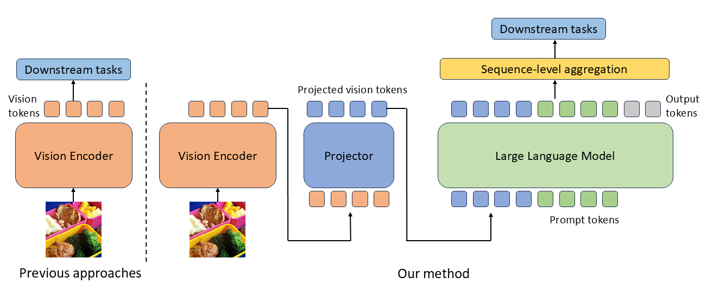

# LLM-Augmented Visual Representation Learning

Official PyTorch implementation for paper *Multi-Modal Large Language Models are Effective Vision Learners*, accepted by *WACV 2025*.

<p align="center">
  
</p>

### Abstract
Large language models (LLMs), pre-trained on vast amounts of text, have shown remarkable abilities in understanding general knowledge and commonsense. Therefore, it's desirable to leverage pre-trained LLM for help solve computer vision tasks. Previous works on multi-modal LLM mainly focus on the generation capability. In this work, we propose LLM-augmented visual representation learning (LMVR). Our approach involves initially using a vision encoder to extract features, which are then projected into the word embedding space of the LLM. The LLM then generates responses based on the visual representation and a text prompt. Finally, we aggregate sequence-level features from the hidden layers of the LLM to obtain image-level representations. We conduct extensive experiments on multiple datasets, and have the following findings: (a) LMVR outperforms traditional vision encoder on various downstream tasks, and effectively learns the correspondence between words and image regions; (b) LMVR improves the generalizability compared to using a vision encoder alone, as evidenced by its superior resistance to domain shift; (c) LMVR improves the robustness of models to corrupted and perturbed visual data. Our findings demonstrate LLM-augmented representation learning is effective as it learns object-level concepts and commonsense knowledge.


### Requirements 

Since our codebase is derived from LLaVA, we follow the same requirements as that project.

1. Install packages
```Shell
conda create -n lmvr python=3.10 -y
conda activate lmvr
pip install --upgrade pip  # enable PEP 660 support
pip install -e .
```

2. Install additional packages for training cases
```
pip install ninja
pip install flash-attn --no-build-isolation
```

3. Upgrade to latest code base

```Shell
git pull
pip uninstall transformers
pip install -e .
```

### Pre-Training
Please follow the instructions [here](https://github.com/haotian-liu/LLaVA/tree/237165b0166ad3fdc4fb0a7d881c857755d2404f).

### Feature Extraction
```bash
sh run_extract.sh
```

### Token-Level Visualization
```bash
visualization.ipynb
```

### Reference
LLaVA: https://github.com/haotian-liu/LLaVA